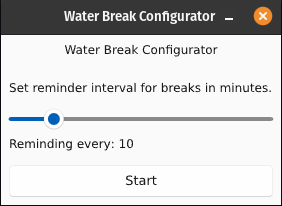

# Water Break
A simple GUI tool for reminding you to hydrate at specified intervals of time.

I usually tend to forget to drink water especially when I am debugging. So, this simple app reminds me to drink water and stay hydrated.

## Build Instructions
```commandline
$ git clone https://github.com/kanakshilledar/water-break
$ cd water-break
$ cargo run water-break
```

## Screenshots
**GUI Configurator**



**Reminder Set Notification**


**Drinking Notification**

